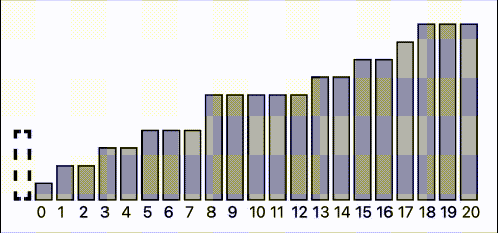

# Заметки в Obsidian

## Как начать пользоваться?

Для начала скачайте программу obsidian для ведения заметок ([ссылка](https://obsidian.md/download)). Далее после скачивания необходимо сохранить файлы с репазитория к себе на компьютер:
```bash
git clone https://github.com/lixelv-itmo/notes.git
```

Также для корректной работы необходимо скачать расширение Multi-Column Markdown ([ссылка](https://publish.obsidian.md/hub/02+-+Community+Expansions/02.05+All+Community+Expansions/Plugins/multi-column-markdown)). Скачайте его и включите его в списке расширений от сообщества и это все, что нужно для корректного использования.

## Демонстрация




## Автор

[lixelv](https://github.com/lixelv) | Ефременко Симеон

## Лицензия

[MIT](https://github.com/lixelv-itmo/notes/blob/main/LICENSE)