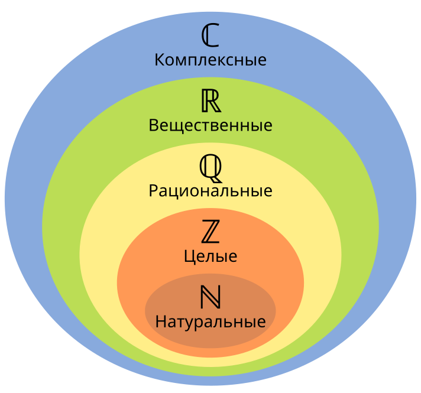

## Определение
Множество - это самая базовая единица алгебры, с помощью которой выводится вся оставшаяся математика. Определяется как совокупность объектов с 1 общим свойством.

---
## Пример
- Множество всех людей сидящих в аудитории
- $\{1, 2, 3\}$ - натуральные числа < 4
- $\mathbb{R}$ - множество вещественных чисел 

---
## Операции множеств
### Принадлежность
Элемент $a$ принадлежит множеству $A$, если $a$ удовлетворяет свойству, по которому определено $A$.
$$a \in A$$

---
### Подмножество
Множество $A$ является подмножеством $B$, если каждый элемент $A$ содержится в $B$.
$$A \subseteq B \Leftrightarrow \forall x , (x \in A \Rightarrow x \in B)$$

---

### Равенство множеств
Два множества равны, если они содержат одни и те же элементы.
$$A = B \Leftrightarrow \forall x , (x \in A \Leftrightarrow x \in B)$$

---

### Объединение
Множество, состоящее из всех элементов $A$ и $B$.
$$A \cup B \Leftrightarrow \forall x , (x \in A \cup B \Leftrightarrow x \in A \lor x \in B)$$

---

### Пересечение
Множество, состоящее из всех элементов, принадлежащих и $A$, и $B$.
$$A \cap B \Leftrightarrow \forall x , (x \in A \cap B \Leftrightarrow x \in A \land x \in B)$$

---

### Разность
Множество элементов $A$, которые не принадлежат $B$.
$$A \setminus B \Leftrightarrow \forall x , (x \in A \setminus B \Leftrightarrow x \in A \land x \notin B)$$

---

### Симметрическая разность
Множество элементов, принадлежащих либо $A$, либо $B$, но не обоим одновременно.

$$A \triangle B \Leftrightarrow \forall x , (x \in A \triangle B \Leftrightarrow (x \in A \lor x \in B) \land \neg(x \in A \land x \in B))$$

---

### Дополнение
Если задан универсум $U$ (все возможные элементы), то дополнение множества $A$ - это всё, что не принадлежит $A$.
$$\overline{A} \space или \space A^c \Leftrightarrow \forall x , (x \in \overline{A} \Leftrightarrow x \in U \land x \notin A)$$

---
### Декартово произведение
Множество всех упорядоченных [пар](Пара.md) $(a, b)$, где $a$ принадлежит $A$, а $b$ принадлежит $B$.
$$A \times B = \{\langle a, b \rangle \; | \; a \in A \; and \; b \in B \}$$

#### Пример: $A \times B = \{1, 2, 3\} \times \{2, 3\} = \{\langle 1, 2 \rangle\, \langle 1, 3\rangle, \langle 2, 2\rangle, \langle 2, 3\rangle, \langle 3, 2\rangle, \langle 3, 3 \rangle\}$

---

### Булеан (множество всех подмножеств)
Для множества $M$ множество $2^M$ содержит все его подмножества.
$$2^M = \{S \,|\, S \subseteq M\}$$
#### Пример: $2^M = 2^{\{1, 2\}} = \{\emptyset, \{1\}, \{2\}, \{1, 2\}\}$
---
## Законы над операциями множеств
Для любых [множеств](Множество.md) $A, B, C$ и универсального множества $U$:

---

### **1. Коммутативные законы**
$$
A \cup B = B \cup A
$$
$$
A \cap B = B \cap A
$$  
Порядок объединения и пересечения не влияет на результат.

---

### **2. Ассоциативные законы**
$$
(A \cup B) \cup C = A \cup (B \cup C)
$$
$$
(A \cap B) \cap C = A \cap (B \cap C)
$$  
Скобки при объединении и пересечении можно расставлять как угодно.

---

### **3. Дистрибутивные законы**
$$
A \cup (B \cap C) = (A \cup B) \cap (A \cup C)
$$
$$
A \cap (B \cup C) = (A \cap B) \cup (A \cap C)
$$  
Объединение распределяется относительно пересечения и наоборот.

---

### **4. Законы де Моргана**
$$
\overline{A \cap B} = \overline{A} \cup \overline{B}
$$
$$
\overline{A \cup B} = \overline{A} \cap \overline{B}
$$  
Отрицание пересечения - это объединение отрицаний; отрицание объединения - это пересечение отрицаний.

---

### **5. Законы тождества (нейтральные элементы)**
$$
A \cup \emptyset = A
$$
$$
A \cap U = A
$$  
Объединение с пустым множеством и пересечение с универсальным не изменяют множество.

Также:
$$
A \cap U = A
$$
$$
A \cup U = U
$$  
Пересечение с универсальным множеством - это само множество, объединение с ним - это всё множество \( U \).

---

### **6. Законы дополнения**
$$
A \cup \overline{A} = U
$$
$$
A \cap \overline{A} = \emptyset
$$
$$
\overline{\overline{A}} = A
$$  
Объединение множества с его дополнением даёт универсум; их пересечение - пустое множество; двойное отрицание возвращает исходное множество.

---
## Аксиомы множеств
### 1. **Аксиома экстенсиональности**  
$$
\forall A \, \forall B \, \left( \forall x \, (x \in A \leftrightarrow x \in B) \rightarrow A = B \right)
$$  
**Перевод:** Множества, имеющие одни и те же элементы, равны.

---

### 2. **Аксиома пустого множества**  
$$
\exists A \, \forall x \, (x \notin A)
$$  
**Перевод:** Существует множество, не содержащее ни одного элемента.

---

### 3. **Аксиома пары**  
$$
\forall a \, \forall b \, \exists C \, \forall x \, (x \in C \leftrightarrow (x = a \lor x = b))
$$  
**Перевод:** Для любых \( a \) и \( b \) существует множество, содержащее только \( a \) и \( b \): \( \{a, b\} \).

---

### 4. **Аксиома объединения**  
$$
\forall A \, \exists B \, \forall x \, (x \in B \leftrightarrow \exists C \, (x \in C \land C \in A))
$$  
**Перевод:** Для любого множества множеств существует их объединение.

---

### 5. **Аксиома множества всех подмножеств (аксиома степени)**  
$$
\forall A \, \exists P \, \forall x \, (x \in P \leftrightarrow x \subseteq A)
$$  
**Перевод:** Для любого множества \( A \) существует множество всех его подмножеств \( \mathcal{P}(A) \).

---

### 6. **Аксиома бесконечности**  
Существует множество \( I \), такое что:  
$$
\emptyset \in I \land \forall x \, (x \in I \rightarrow x \cup \{x\} \in I)
$$  
**Перевод:** Существует бесконечное множество, содержащее натуральные числа.

---

### 7. **Аксиома выделения (схема аксиом сепарации)**  
Для любой формулы \( P(x) \):  
$$
\forall A \, \exists B \, \forall x \, (x \in B \leftrightarrow x \in A \land P(x))
$$  
**Перевод:** Из любого множества \( A \) можно выделить подмножество, удовлетворяющее свойству \( P(x) \).

---

### 8. **Аксиома замены (схема аксиом замещения)**  
Если \( F \) - функциональное отношение, то:  
$$
\forall A \, \exists B \, \forall y \, (y \in B \leftrightarrow \exists x \in A \, (F(x, y)))
$$  
**Перевод:** Образ множества \( A \) при функциональном отображении \( F \) также является множеством.

---

### 9. **Аксиома фундамента (регулярности)**  
$$
\forall A \, \left( A \ne \emptyset \rightarrow \exists x \in A \, (x \cap A = \emptyset) \right)
$$  
**Перевод:** У любого непустого множества есть элемент, не пересекающийся с ним. Исключает самопринадлежность.

---

### 10. **Аксиома выбора**  
$$
\forall A \, \left( \forall x \in A \, (x \ne \emptyset) \rightarrow \exists f: A \rightarrow \bigcup A \, (f(x) \in x) \right)
$$  
**Перевод:** Для любой коллекции непустых множеств существует функция выбора.

---
## Численные множества
--- start-multi-column: ExampleRegion1  
```column-settings  
number of columns: 2  
Border: false
Shadow: false
```

- $\mathbb{N}$ - натуральные числа
- $\mathbb{Z}$ - целые числа
- $\mathbb{Q}$ - рациональные числа
- $\mathbb{R}$ - вещественные числа
- $\mathbb{C}$ - комплексные числа

--- end-column ---



--- end-multi-column
$$\mathbb{N} \space \{1, 2, 3\} \subset \mathbb{Z} \space \{0, -1, -2\} \subset \mathbb{Q} \space \{\frac{1}{3}, 0.75, -0.4\} \subset \mathbb{R} \space \{-0.5, 2, \sqrt{3}\} \subset \mathbb{C} \space \{1, -3i, \sqrt{2} + 0.7i\}$$

---
## [Wiki](https://ru.wikipedia.org/wiki/Множество#Операции_над_множествами)